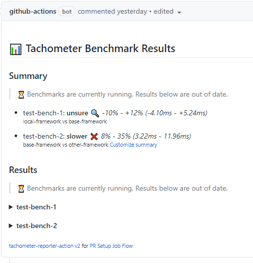
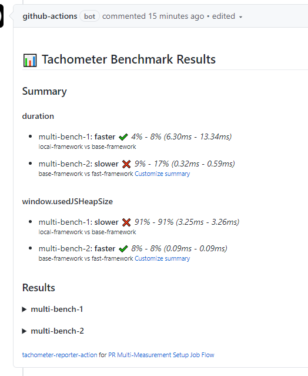

# tachometer-reporter-action

Report the results of
[Polymer/tachometer](https://github.com/polymer/tachometer) in a comment for
Pull Requests.


## Usage

### Single benchmark job

Simply pass in the path to the resulting JSON file from running tachometer.

```yaml
name: Pull Request Test

on: [pull_request]

jobs:
  pr_test:
    runs-on: ubuntu-latest

    steps:
      # Setup repo to run benchmarks
      - uses: actions/checkout@v2
      - uses: actions/setup-node@v1
      - run: npm ci

      # Run benchmarks
      - name: Run tachometer and generate results file
        run: npm run tach --config benchmarks.json --json-file results.json

      # Read results and post comment
      - name: Report Tachometer Result
        uses: andrewiggins/tachometer-reporter-action@v2
        with:
          path: results.json
```

### Multiple benchmark jobs

For multiple benchmark jobs, upload the result JSON files to an artifact. Then
download the results in a final job that reports the results of all the files.

```yaml
name: Multiple benchmark jobs example

on: [pull_request]

# Demo how to report results for multiple benchmarks that run in different jobs
#
# In this flow, a workflow must upload the results from each benchmark job as
# artifacts. Once all the jobs have finished, then run this action in a final
# job that downloads the results artifact and reports the results from all the
# jobs

jobs:
  # If you'd like a message to appear in existing results comment that the
  # benchmarks are current running and the shown results are out of date, run a
  # job before the benchmarks with the initialize option set to true.
  setup:
    name: Setup Tachometer Reporting
    runs-on: ubuntu-latest
    steps:
      - name: Initialize tachometer comment
        uses: andrewiggins/tachometer-reporter-action@v2
        with:
          initialize: true

  bench_1:
    name: First Bench Job
    needs: [setup]
    runs-on: ubuntu-latest
    steps:
      # Setup repo to run benchmarks
      - uses: actions/checkout@v2
      - uses: actions/setup-node@v1
      - run: npm ci

      # Run benchmarks. Ensure each job's results file has a unique name
      - name: Run tachometer and generate results file
      - run: npm run tach --config benchmarks.json --json-file bench_1.json

      # Upload this benchmarks results
      - uses: actions/upload-artifact@v2
        with:
          name: results
          path: bench_1.json

  bench_2:
    name: Second Bench Job
    needs: [setup]
    runs-on: ubuntu-latest
    steps:
      - uses: actions/checkout@v2

      # Add other tasks similar to bench_1 job to run the second benchmark. Make
      # sure each job results file has a unique name

      # Upload this benchmarks results
      #
      # Since each result file has a unique name, we can upload to the same
      # artifact. GitHub Actions will append the new files to the existing
      # artifact. See the docs for upload-artifact to understand this behavior:
      # https://git.io/JtOak
      - uses: actions/upload-artifact@v2
        with:
          name: results
          path: bench_2.json

  report_results:
    name: Report Results
    needs: [bench_1, bench_2]
    runs-on: ubuntu-latest
    steps:
      # Download the results artifact
      - uses: actions/download-artifact@v2
        with:
          name: results
          path: results

      # Read all the results and post comment
      - name: Report Tachometer Result
        uses: andrewiggins/tachometer-reporter-action@v2
        with:
          path: results/*.json
```

### Working with forks

Since the `pull_request` event doesn't have permissions to write comments to PRs
when triggered by a PR from a fork, we'll instead use the `workflow_run` event
to do the reporting. We'll build on the previous example of uploading the
results to an artifact. This time however, we'll download the artifact and post
the results to the PR from a `workflow_run` event.

In general, while this flow is the most complicated, this is the recommended
flow as it should work for any PR that is opened against your repository.

Be sure to always run the benchmark in a `pull_request` event for [security
reasons](https://securitylab.github.com/research/github-actions-preventing-pwn-requests).
Just post the comment using this action in the `workflow_run`.

#### Pull Request workflow file

```yaml
name: PR CI

on:
  pull_request:
    branches:
      - "**"

jobs:
  bench_1:
    name: First Bench Job
    runs-on: ubuntu-latest
    steps:
      - uses: actions/checkout@v2
      # Run your benchmarks
      - run: ./benchmark.sh
      # Upload the results to an artifact
      - uses: actions/upload-artifact@v2
        with:
          name: results
          path: results-1.json

  bench_2:
    name: Second Bench Job
    runs-on: ubuntu-latest
    steps:
			- uses: actions/checkout@v2
      - run: ./benchmark.sh
      - uses: actions/upload-artifact@v2
        with:
          name: results
          path: results-2.json
```

#### Workflow Run workflow file

```yaml
name: Report Tachometer Results

on:
  workflow_run:
    workflows: ["PR CI"]
    branches: ["**"]
    types:
      - completed
      - requested

jobs:
  # Optional job to update existing comments with a "benchmarks are running" text
  report_running:
    name: Report benchmarks are in-progress
    runs-on: ubuntu-latest
    # Only add the "benchmarks are running" text when the workflow_run starts
    if: ${{ github.event.action == 'requested' }}
    steps:
      - name: Report Tachometer Running
        uses: andrewiggins/tachometer-reporter-action@main
        with:
          # Set initialize true so this action just creates the comment and adds
          # the "benchmarks are running" text
          initialize: true

  report_results:
    name: Report benchmark results
    runs-on: ubuntu-latest
    # Only run this job if the event action was "completed" and the triggering
    # workflow_run was successful
    if: ${{ github.event.action == 'completed' && github.event.workflow_run.conclusion == 'success' }}
    steps:
      # Download the artifact from the triggering workflow that contains the
      # Tachometer results to report
      - uses: dawidd6/action-download-artifact@v2
        with:
          workflow: ${{ github.event.workflow.id }}
          run_id: ${{ github.event.workflow_run.id }}
          name: results
          path: results

      # Create/update the comment with the latest results
      - name: Report Tachometer Results
        uses: andrewiggins/tachometer-reporter-action@main
        with:
          path: results/*.json
```

## Features

- Pick a summary of comparisons to highlight at the top
- See what benchmarks are currently running
<!-- - Keep a log of benchmark results from this PR -->

### Summaries

`tachometer-reporter-action` will generate a summary of results for you if you
provide a `pr-bench-name` and `base-bench-name`. This summary will take the
results of comparing the results identified by the `pr-bench-name` vs. the
results identified by the `base-bench-name` and put them at the top of the of
the comment.

By default, if `pr-bench-name` or `base-bench-name` are not provided, then the
first two benchmarks in the tachometer results will be compared.

You can also define which measures are summarized in the summary section. Pass
the names of the measures you want to summarize to the `summarize` option. It
accepts the value `true` (the default) to summarize all measures, `false`
meaning to summarize nothing from this run, or a string of comma separated
measurement names (e.g. `measure1, measure2`) to include in the summary.

### In-progress benchmarks



To get a message in your comment to inform you if your benchmarks are currently
running, add a job before your benchmarks that uses this action with the
`initialize: true` input. This instance of `tachometer-reporter-action` will
create a comment if none exists, or update an existing one with a message that
the benchmarks are currently running.

See the [Multiple benchmark jobs](#multiple-benchmark-jobs) usage sample for an
example of how to set this up.

### Multiple measurements in one benchmark



Tachometer supports defining multiple measurements per benchmark configuration.
In the summary section, we group summaries by measurements. In the result
details for each benchmark, we build tables for each measurement in that
benchmark.

## Inputs

### Required

#### path

The path to the results JSON file of the tachometer run.

### Optional

#### initialize

Determines whether this action instance should initialize the comment to report
results. Will also add "Benchmarks are running" text to existing comments.

Useful if multiple jobs are sharing the same comment. Pass in `true` if
this job should always create the comment, `false` if this job should never
create the comment, or leave empty if the default behavior is desired (wait a
random time before creating comment if it doesn't exist. Due to race conditions,
this could lead to duplicate comments and is not recommended if your workflow
has multiple jobs using this action).

Generally this option is only necessary if you are running multiple jobs in the
same workflow with this action. If so, create a "setup" job to that initializes
the comment by passing initialize: true. Then each other job that actually
reports benchmark results must declare the "setup" job as a dependency in its
"needs" array. See the [Multiple benchmark jobs](#multiple-benchmark-jobs) usage
sample for an example.

### summarize

Specify which measurements to include in the summary for this benchmark. Accepts
the following values:

<dl>
  <dt><code>true</code> (default)</dt>
  <dd>Include all measurements from this run in the summary section</dd>
  <dt><code>false</code></dt>
  <dd>Summarize nothing from this run</dd>
  <dt>include string</dt>
  <dd>
		Only include the listed measurements in the summary string.
		Must be a string of comma-separated measurement names
		(e.g. <code>summarize: measure1, measure2</code>)
  </dd>
</dl>

#### default-open

Pass `true` to this option to automatically open this actions benchmark results
in the PR comment. By default, all results are collapsed.

<!--
#### keep-old-results

Pass `true` to this option to keep old benchmarks results in the PR comment
(collapsed under the latest results). By default, the action will override any
existing benchmark results with the latest results.
-->

#### pr-bench-name

The benchmark or version (identified in Tachometer results by either the "name"
field or "version" field) which represents the changes made in this PR.

#### base-bench-name

The benchmark or version (identified in Tachometer results by either the "name"
field or "version" field) which serves as the base this PR is to be compared
against (e.g. the latest published version of your library/website).

## Notes

### Multiple comments

This action will create one comment per workflow that uses it. So if you have
two workflows that each run two jobs that use this action (a total of 4
instances of this action), you should have two comments in your PR.

By default, `tachometer-reporter-action` relies on a timing heuristic so that
multiple jobs don't try to create multiple comments at the same time. However
this timing heuristic doesn't work for all workflow configurations. To
workaround this use the [`initialize`](#initialize) option to instruct only one
`tachometer-reporter-action` instance in a workflow to initialize the comment
all other `tachometer-reporter-action`s will share. See the [Multiple benchmark
jobs](#multiple-benchmark-jobs) usage sample for an example.

### Sorting

The results are inserted into the comment based on the title of the benchmark
that produced the results. So a workflow that has multiple jobs reporting
results will show the results in the lexical order of their titles. The title
for a result file is determined based on the name and version fields of the
tachometer benchmark results.

### Only latest updates are shown

If you quickly push to a PR, two different workflow runs could be triggered at
close to the same time. Depending on how long the benchmarks take to run, the
earlier workflow run running not the latest code could complete after the later
workflow run running the latest code.

To prevent this situation, where older out-of-date results could override the
latest results, only results that come from a workflow run with a run number
equal or higher to the current run number in the comment will be written.

### Cooperative comment locking

If your action has multiple benchmarks running in different jobs, it is possible
that the reporter-action will try to overwrite each other's results if both jobs
read the comment before either has updated it with their results. In this
situation, both jobs get a view of the comment with no results and only adds
their results to the comment. The last job whose update is written would
overwrite the update of the other job.

To mitigate this situation, this action implements a basic "locking" mechanism
on the comment. Before any job can make significant changes to the comment, it
must first write an empty `span` to the comment with an ID and wait a short time
to ensure all other jobs have seen it's `span`, claiming the comment as locked.
If another job sees that this `span` exists, it will wait a random amount of time
before trying to acquire the comment lock for itself. This protocol isn't perfect,
but it is likely good enough for our purposes.
